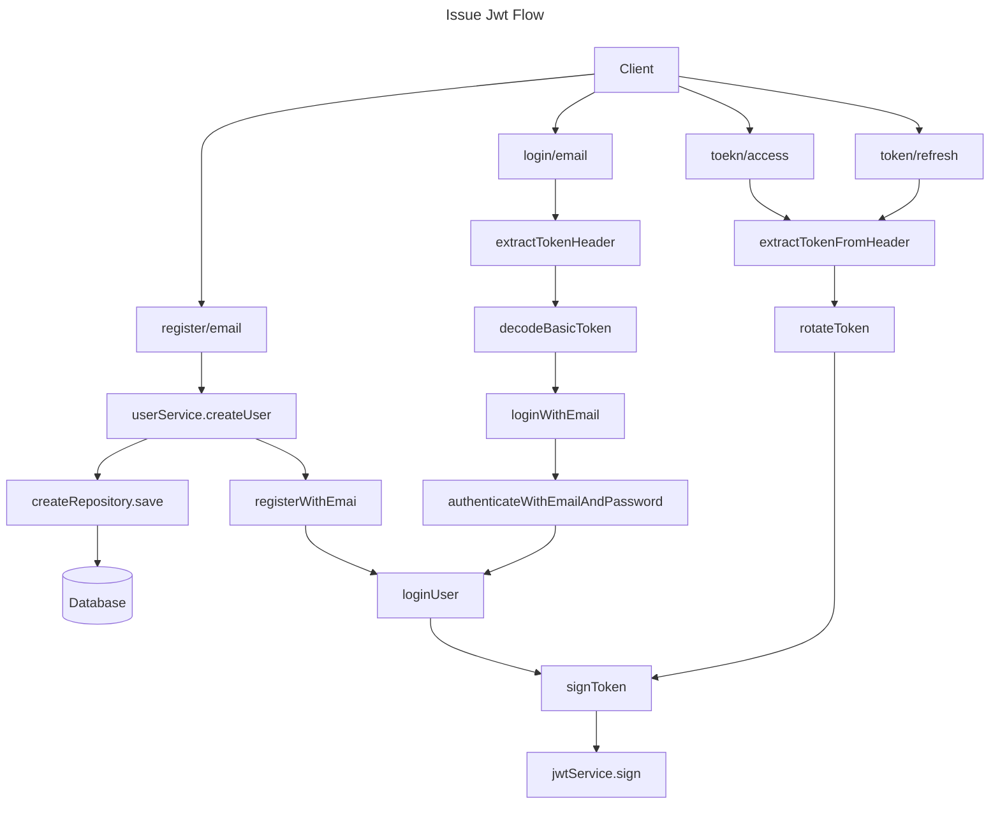

# Auth Flow

```mermaid
---
title: Issue Jwt Flow
---
flowchart TD
    Client --> A[register/email] & B[login/email] & C[toekn/access] & D[token/refresh]
    loginUser --> signToken --> jwtService.sign
    extractTokenFromHeader --> rotateToken --> signToken
    userService.createUser --> createRepository.save --> id[(Database)]
    A --> userService.createUser --> registerWithEmai --> loginUser
    B --> extractTokenHeader --> decodeBasicToken --> loginWithEmail --> authenticateWithEmailAndPassword --> loginUser
    C --> extractTokenFromHeader
    D --> extractTokenFromHeader
```