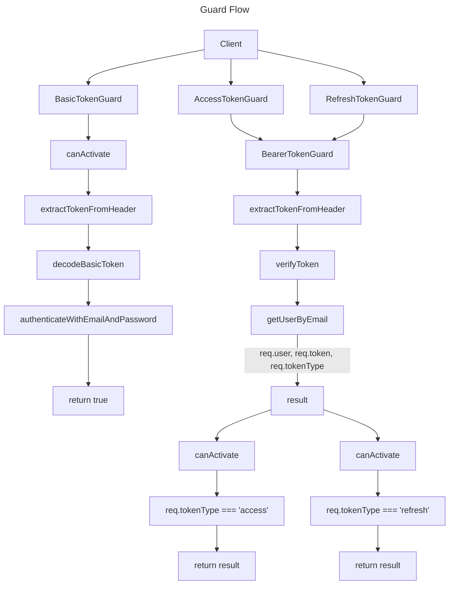

# Guard Flow

```mermaid
---
title: Guard Flow
---
flowchart TD
    Client --> A[BasicTokenGuard] & B[AccessTokenGuard] & C[RefreshTokenGuard]
    A --> c1[canActivate] --> e1[extractTokenFromHeader] --> decodeBasicToken --> authenticateWithEmailAndPassword --> rr[return true]
    B --> BearerTokenGuard
    C --> BearerTokenGuard
    BearerTokenGuard --> extractTokenFromHeader --> verifyToken --> getUserByEmail -- req.user, req.token, req.tokenType --> ret[result]
    ret[result] --> c2[canActivate] --> fc["req.tokenType === 'access'"] --> ret1[return result]
    ret[result] --> c3[canActivate] --> fs["req.tokenType === 'refresh'"] --> ret2[return result]
```
